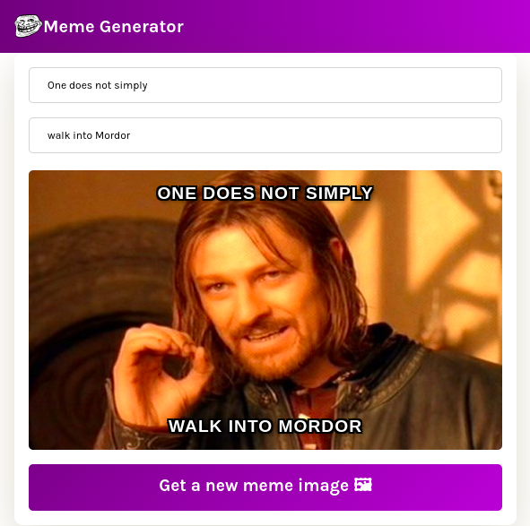

# meme-generator-react

Live demo [_here_](https://sashauly.github.io/meme-generator-react/).

## Table of contents

- [meme-generator-react](#meme-generator-react)
  - [Table of contents](#table-of-contents)
  - [General info](#general-info)
  - [Technologies](#technologies)
  - [Setup](#setup)
  - [Features](#features)
  - [Project status](#project-status)
  - [Contacts](#contacts)

## General info

Dynamic website which provide you some random meme from [ImgflipAPI](https://imgflip.com/api)

## Technologies

Project is created with:

- JavaScript ES6
- fetch() method with [ImgflipAPI](https://imgflip.com/api)
- [React 18.2.0](https://react.dev/)(event listeners,states, conditional rendering,forms,side effects)
- [vite 4.4.0](https://vitejs.dev/)

## Setup

Just open [the live version](https://sashauly.github.io/meme-generator-react/). For now this project served for presentation purposes

## Features

- Getting new meme from [ImgflipAPI](https://imgflip.com/api) on button click
- Possibility to add text for the meme above and below the meme

## Project status

Project is: _complete_

## Acknowledgements
- This project was based on [this Scrimba course tutorial](https://scrimba.com/learn/learnreact).

## Contacts

Created by [@sashauly](https://t.me/sashauly) - feel free to contact me!
